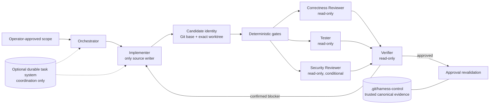

# verified-agent-harness 1.0.0

`verified-agent-harness` is a provider-neutral, trusted-local engineering workflow. It turns a code change into revision-bound evidence through one writer, deterministic gates, independent read-only assessment, independent verification, and explicit approval. Agent products and orchestration platforms are supplied through adapters rather than encoded as role identities. The project is deliberately a workflow and evidence system, not a general autonomous swarm or a hostile-repository sandbox.

The 1.0 redesign was bootstrapped in an isolated staging repository from base `9af9a02dd29c91f32ab5133fb18f92c5fe906ec2`. Its initial candidate (`candidate-v1:15ee0447d998e47e0005d633bcd0efbff39808eb9e852540244c126711bc64d9`) passed 61 deterministic tests and an independent review. Source-repository integration then received a separate security review and additional fixes for attempt accounting, lifecycle command separation, and deployment commit-point recovery. Treat the current Git commit—not the historical staging candidate—as the release identity.

## Architecture



The repository distributes two cooperating Skills as one verified system. `project-lifecycle-harness` is the upper-level entry point that classifies and harnesses a repository; once a project is compatible and activated, the top-level router delegates Stage/Slice execution to `verified-agent-harness`. They are installed and regression-tested together rather than versioned as unrelated components.

The repository has four cooperating layers:

- `skill/` is the exact split 1.0.0 Stage/Slice Skill: a small launcher, `harness_core.py`, `harness_parallel.py`, `harness_commands.py`, strict contracts, templates, references, and its local test suite.
- `lifecycle-skill/` routes greenfield bootstrap, brownfield adoption, compatible operation, and explicit migration. Its transactional adoption and rollback engine remains separate from the 1.0 Stage engine.
- `plugin/` provides optional read-only context occupancy and compaction fallback tools.
- `bin/harness` routes lifecycle-only commands to the lifecycle component and Stage commands to the 1.0 Skill.

The configured Orchestrator owns operator interaction and outer task coordination. Agent adapters perform bounded role execution. The Harness owns canonical local state transitions and evidence validation. Git owns the stable base revision; deterministic commands and the Verifier—not an agent assertion—own completion evidence.

## Agent adapter contract

The core invokes `[agent_runtime].adapter_argv` directly without a shell. It appends canonical role, access, workdir, prompt, JSON Schema, output path, optional model alias, optional per-role reasoning effort, and ephemerality arguments. Only Implementer may receive `workspace-write`; every assessor, Verifier, adviser, and lifecycle label receives `read-only`. The trusted adapter is responsible for enforcing that access mode. The core independently recomputes candidate identity and rejects evidence after any mutation, but this is detection rather than kernel-level containment. An adapter must also implement secret-free `--describe` with contract version `1.1` and routing capabilities.

The repository ships `skill/adapters/codex_cli.py` as a reference adapter for the user's current setup. Other agent CLIs are supported only after an adapter implements the executable contract in `skill/references/adapter-contract.md` and passes the contract and workflow tests. Merely changing a product name or prompt does not establish compatibility.

### Bundled Codex routing policy

Generic templates remain provider-neutral: `[agent_runtime.models]` and `[agent_runtime.reasoning_efforts]` are optional role-keyed adapter inputs. The bundled Group deployment explicitly uses the following reference-adapter policy:

| Role | Model/reasoning |
|---|---|
| Implementer | Terra/ultra |
| Correctness Reviewer | Sol/medium |
| Tester | Terra/xhigh |
| Security Reviewer | Sol/medium |
| Verifier | Sol/medium |
| Explorer | Luna/xhigh |
| Researcher | Terra/xhigh |
| Test Triage | Luna/xhigh |
| Log Triage | Luna/xhigh |
| Architecture Analyst | Terra/xhigh |
| Independent Auditor | Sol/medium |
| Final Lifecycle Reviewer | Sol/medium |

The bundled Group policy explicitly assigns `ultra` to the Implementer so complex writable work receives the strongest planning, debugging, and correction effort. The reference adapter still derives `medium` for configured Sol and `xhigh` for configured Terra or Luna when a role effort is omitted; an explicit valid role effort wins. The lifecycle labels are read-only routing labels only: lifecycle state remains outside the Stage engine.

## Workflow classes

| Class | Use | Required inner flow |
|---|---|---|
| `FAST` | Trivial, localized, low-risk change | One writer plus direct deterministic checks; no Stage engine solely for FAST work |
| `VERIFIED` | Default nontrivial change | Implementer → gates → Reviewer + Tester → Verifier → approval |
| `SECURITY` | Security-sensitive scope | VERIFIED plus a required Security Reviewer |
| `DAG` | Genuinely independent writable tasks | Hermes freezes a machine-readable contract, validates isolated Git lanes, applies memory admission/backpressure, and verifies the integrated candidate through the inner flow |
| `LONG_RUNNING` | Durable asynchronous work | Kanban tasks, event-driven waiting, explicit completion contracts, and the same inner evidence gate |

## Authority and evidence DAG

- The Implementer is the only ordinary source writer in a candidate worktree.
- Gates run configured argument arrays without a shell.
- Reviewer, Tester, optional Security Reviewer, and Verifier are read-only.
- Explorer, Researcher, Test Triage, and Log Triage are optional read-only, non-authoritative advisers. `harness run-advisory --role <role>` is their one bounded command. Advice is structured and candidate-bound during a Stage, but is runtime-only: it cannot mutate source, satisfy an assessment, enter the Verifier join, approve, or force repair.
- Assessors produce hypotheses, not approval. The Verifier classifies every finding as `confirmed`, `rejected`, `inconclusive`, or `flaky_or_infra`.
- Only confirmed policy-blocking findings enter `CHANGES_REQUIRED`. Policy-blocking inconclusive evidence fails closed to `BLOCKED`.
- Approval rereads canonical reports and recomputes the current candidate, protected baseline, Git HEAD, and worktree identity.
- A tentative Implementer attempt is released only for a positively recognized spawn/exec or agent output-schema startup rejection before business work when the worktree remains unchanged. Timeouts, ordinary nonzero exits, changed-worktree failures, invalid or missing handoffs, and runtime-integrity failures remain charged. Product attempts remain capped by project policy.

Canonical control state and accepted evidence live under `.git/harness-control/`. Files under `.harness/` are project-facing mirrors or runtime diagnostics. A candidate ID binds the Stage `base_sha` to exact changed worktree content; credential-shaped files contribute metadata only and their contents are not read. Any candidate change invalidates prior gate, assessor, and Verifier evidence.

## Outer orchestration boundary

Kanban or another durable task system is an optional outer coordination plane for DAG and long-running work. It can track dependencies, events, worktrees, retries, and handoffs, but its flexible metadata cannot approve a candidate and never replaces `.git/harness-control/`.

For a Hermes-led DAG, validate and freeze the committed plan before launching writable lanes, validate every lane from Git rather than worker prose, and keep the memory guard active throughout each wave:

```bash
harness validate-parallel-plan --plan-file parallel-plan.json
harness freeze-parallel-plan --run-id feature-x --plan-file parallel-plan.json
harness validate-parallel-lane --base-sha "$BASE" --head-sha "$LANE" --write-path src/component
harness register-parallel-worker --run-id feature-x --task-id component
# Move the worker into the returned Harness-owned cgroup, then prove it is populated.
harness activate-parallel-worker --run-id feature-x --task-id component
harness memory-guard --run-id feature-x --interval 2
```

Contract-owner tasks are dependency-free, own only frozen contract paths, and are already complete in the clean committed base. The atomic `.git/harness-parallel/<run_id>/run.json` bundle binds only revalidatable facts: plan, base, contract blobs, lanes, generation, and workers. Each command retains one safely opened directory FD through locking and canonical I/O; canonical files must be owner-controlled, single-link regular files. A worker is admitted only after every dependency is frozen or validated and is then bound to the exact run, task, generation, and complete cgroup v2 containment. Recovery streak and admission decisions remain process-local derived state; three recovered samples are required before one worker resumes. With no active workers Hermes switches to serial; an active uncontained worker enters `BLOCKED_UNCONTAINED` until drained. `memory-guard-step` is read-only and rejects `--apply`.

The Skill does not implement or claim a hosted CI service, distributed scheduler, A2A or MCP transport, or any provider app-server integration. A deployment may use such systems as execution boundaries, but they must preserve the same role permissions, isolated worktrees, candidate binding, and canonical evidence checks. Notifications are wakeups only; the Orchestrator must reread canonical state after each wakeup.

## Migration from 0.4/0.5 deployments

Do not mutate an active pre-1.0 Stage in place. Finish it with its original installed Skill or explicitly abandon it under operator control. Migrate only between Stages:

1. Back up project control artifacts and the installed payload.
2. Install 1.0.0 transactionally.
3. Review and merge the new project configuration keys, including protected project-state files and optional per-role model aliases.
4. Run `harness doctor` from the target project and inspect config/state together.
5. Start the next Stage so 1.0 captures a new protected baseline and candidate identity.

`config_version` remains `1`; unknown versions fail closed. Existing user files and Git history are not migration inputs to overwrite.

## Installation and transactional deployment

Core requirements are Linux, Python 3.11 or newer, Git, and a contract-compatible agent adapter. The included reference deployment additionally uses Hermes Agent, Codex CLI, PyYAML, and standard shell tools. Keep the source repository separate from installation targets.

Deployment is intentionally clean-commit-only. `scripts/deploy` refuses a dirty source, exports tracked files from `HEAD`, validates and stages the complete payload, backs up every exact target, replaces all targets transactionally, runs a post-deploy doctor, compares installed manifests, and creates and verifies a retained archive. The explicit commit point is reached only after that archive matches every prior target. Before that point, rollback first atomically quarantines a target and verifies the quarantined root object's device/inode/type token; restoration then uses Linux `renameat2(RENAME_NOREPLACE)` so a concurrently created pathname is never overwritten. A distinct object is not treated as transaction-owned merely because its bytes and mode match the staged payload. If another process replaces a target before or during quarantine/restore, rollback fails closed and preserves the unrelated object plus the verified hidden backup instead of deleting external work. Even an owned staged object is intentionally retained at its reported hidden quarantine path rather than deleted through a pathname race; inspect and remove these `rollback_quarantine_retained` artifacts only after exclusive ownership is re-established. This deployment therefore requires exclusive writers for its target paths. After the commit point, temporary-backup cleanup is best-effort: cleanup failure leaves the installed generation and verified retained archive intact and reports a warning. It does not deploy the current uncommitted worktree.

After committing an intentionally reviewed release candidate in your own workflow, configure portable target paths and deploy:

```bash
export HERMES_DEPLOY_HOME="<hermes-home>"
export HARNESS_BIN_DIR="<user-bin-directory>"
export GROUP_PROJECT_ROOT="<target-project>"
scripts/deploy
```

The variables are mandatory to prevent accidental deployment to machine-specific defaults. The target Hermes configuration must already exist as a regular, non-symlink file. Deployment keeps exact target manifests, rejects symlinked required payload files and generated bytecode, detects post-doctor drift, and retains a generation-bound backup after success.

For source-layout inspection without deployment:

```bash
PYTHONDONTWRITEBYTECODE=1 skill/scripts/harness --version
PYTHONDONTWRITEBYTECODE=1 skill/scripts/harness doctor
```

## Examples

Initialize and run a VERIFIED Stage in a committed project:

```bash
harness init
harness start-stage --workflow VERIFIED --stage S1 --title "Bounded change" \
  --slice S1.1 --plan-file docs/approved-plan.md
harness run-implementer
harness run-gates --level slice
harness run-reviewer
harness run-tester
harness run-verifier
harness approve-slice --complete-stage
```

For a security-sensitive Stage, select `--workflow SECURITY` at Stage start and run `harness run-security-reviewer` before the Verifier. Workflow policy cannot be toggled during an active Stage.

Deployments that can check provider authentication or other launch prerequisites without exposing secrets may set `[agent_runtime].preflight_argv` and an optional `preflight_timeout_seconds` (1–300). The trusted argv runs with no shell and discarded input/output before a worker generation or business attempt is allocated; any failure leaves workflow state unchanged.

Use optional advice without changing the Stage evidence DAG:

```bash
harness run-advisory --role explorer
harness run-advisory --role log_triage --dry-run
```

`run-advisory` refuses while another worker or gate is active. Its runtime evidence records the requested model and reasoning effort but never becomes trusted approval evidence.

Inspect identity and state without granting approval:

```bash
harness candidate-id --json
harness status --json
```

## Verification

Run the Skill-local suite and the complete source-repository suite with bytecode disabled:

```bash
PYTHONDONTWRITEBYTECODE=1 python3 skill/scripts/test_harness.py -v
PYTHONDONTWRITEBYTECODE=1 PYTHONWARNINGS=error::ResourceWarning \
  python3 -m unittest discover -s tests -v
bash -n scripts/deploy bin/harness
python3 -m json.tool skill/schemas/quality-gates.schema.json >/dev/null
git diff --check
```

Root discovery loads the Skill-local suite through a thin wrapper, then runs independent lifecycle and deployment coverage. Deployment tests inject faults through every pre-commit transaction phase, require byte-identical rollback for transaction-owned pathnames, and verify fail-closed preservation when an unrelated writer replaces a target; post-commit cleanup faults must preserve the installed generation and retained archive.

## Deep Research summary

The user-supplied research recommends an evidence-driven DAG rather than a free-form swarm: Hermes as the durable controller, one writer per worktree, parallel read-heavy review/testing where useful, a separate Verifier, revision-pinned evidence, bounded repair, and deterministic CI authority. It also emphasizes selective parallelism because coding work has fewer independent branches than research and write-heavy concurrency raises conflict and coordination cost.

The complete, unmodified report is [docs/research/deep-research-report.md](docs/research/deep-research-report.md). Read its [provenance note](docs/research/README.md) before relying on snapshot-dated product or model claims.

| Decision | Research idea | 1.0.0 treatment |
|---|---|---|
| Adopted | Single writer, multiple independent readers, separate Verifier | Enforced by trusted-adapter access controls, mutation-detecting candidate binding, state transitions, and strict report contracts |
| Adopted | Revision-bound evidence and deterministic completion authority | Adapted to `base_sha` plus credential-safe `candidate_id`, allowing uncommitted Slice candidates |
| Adopted | Bounded repair and explicit infra/flake classification | Three business attempts by default; infrastructure-only failures are released from that budget |
| Adapted | Hermes Kanban as durable workflow state | Optional outer coordination; typed `.git/harness-control/` remains approval authority |
| Adapted | Immutable commit for every candidate | Stable Git base plus exact worktree fingerprint; commits remain Stage/project policy |
| Adapted | Parallel reviewer fan-out | Logical fan-out may run serially when host resources make concurrency unsafe |
| Rejected | Mandatory named model assignments | Optional deployment aliases avoid binding policy to drifting product labels |
| Rejected | A custom distributed scheduler/message bus inside the Skill | Existing Hermes primitives may coordinate externally; the Skill stays local and fail-closed |
| Rejected | Broad privilege fallback for sandbox incompatibility | Trusted-local execution retains bounded role permissions and does not claim hostile-repository containment |

## Repository layout

```text
bin/harness                     installed command router
lifecycle-skill/                lifecycle routing, schemas, templates, transactional adoption/rollback
plugin/                         optional read-only context plugin
projects/Group/config.toml      deployment-specific project configuration payload
scripts/configure-hermes        conservative Hermes configuration transformation
scripts/deploy                  clean-commit frozen exporter
scripts/deploy_transaction.py   exact-target transactional installer and rollback
skill/                          exact verified-agent-harness 1.0.0 candidate payload
tests/                          root integration, lifecycle, and deployment tests
docs/research/                  unmodified research input and provenance
```

## Limitations and security model

This is a trusted-local Linux system. Workers and gates execute as the current Unix user. Process groups, child-subreaper cleanup, optional cgroup v2, temporary homes, environment allowlists, safe artifact opening, revision checks, credential redaction, and protected-path snapshots reduce accidental damage and stale-evidence acceptance. They do not contain a malicious repository, hostile dependency, compromised same-UID process, administrator, kernel, filesystem, Orchestrator installation, or agent runtime binary.

Network and secret authority are denied to ordinary roles by policy, but this is not kernel-enforced hostile-code isolation. Do not run untrusted project commands solely because they appear in a gate configuration. External CI, publication, merge, push, tag, release, and deployment authority remain outside the Skill unless separately and explicitly granted.

Lifecycle adoption rollback uses trusted-local Linux atomic rename operations, prevalidated journals, generation-bound archives, CAS checks, and fail-closed recovery. Transactional installation separately uses staged exact-target replacement, byte-identical rollback tests, and post-doctor manifest verification. Neither mechanism weakens the clean-source requirement or converts this project into a general sandbox.

Licensed under the [MIT License](LICENSE).
