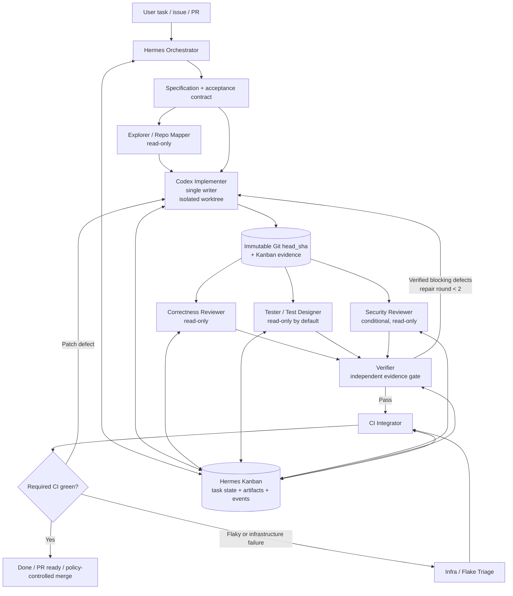

# Current Multi-Agent LLM Architectures for Code Implementation and Review in Hermes

*Research snapshot: August 9, 2026, Asia/Tokyo. Language note: your request is already grammatically well-formed; I use the stylistically more natural term “Codex harness” rather than “Codex-harness” below.*

## Executive summary

The strongest architecture for improving a Hermes Codex skill today is **not a free-form swarm of coding agents**. It is a **Hermes-controlled, evidence-driven DAG with Codex-native leaf workers**: one authoritative orchestrator owns task state and permissions; one implementer owns each writable worktree; independent read-only reviewers, testers, and optional security specialists fan out against an immutable commit; a verifier checks their claims and execution evidence; and a narrowly privileged CI integrator moves only verified revisions toward merge. Long-running state should live in Hermes Kanban rather than in agent conversation history. This recommendation closely matches both Hermes's own 2026 evolution and current OpenAI guidance. Hermes v0.20.0 already ships A2A v1.0, durable Kanban orchestration, background subagents, verification evidence, coding worktrees, event hooks, and an optional Codex app-server runtime. citeturn16view0turn16view2turn17view0

The public upstream Hermes Codex skill, however, remains comparatively thin: `SKILL.md` is version 1.0.1 and primarily documents `codex exec`, background process polling, sandbox flags, PR review, and worktree-based parallel issue fixing. It does **not** itself specify a role graph, evidence schema, immutable-revision protocol, bounded review loop, CI gate, model routing policy, observability metrics, or durable multi-agent state machine. That gap is an inference from the current skill contents rather than a statement made by Hermes maintainers. citeturn16view3

The most important architectural change is therefore to make the skill a **workflow policy**, rather than merely a Codex CLI usage guide:

> **Hermes owns control, state, policy, retries, and completion. Codex owns bounded coding/review execution inside its native harness. Git owns immutable code versions. Tests and CI own ground truth.**

That division is particularly appropriate because Hermes's current Codex app-server runtime gives Codex its native shell, `apply_patch`, plan tracking, sandbox and MCP tooling while Hermes remains the surrounding session/product layer. Hermes's app-server route does not expose ordinary `delegate_task` inside the Codex loop, whereas Kanban worker callbacks are supported; a separate proposal to make Codex app-server a native `delegate_task` leaf backend remains open as of this research snapshot. citeturn15view0turn16view4

This also aligns with OpenAI's current architecture. Codex now has first-class subagents and explicitly recommends parallel subagents for **read-heavy** activities such as exploration, testing, triage, and summarization, while warning that parallel write-heavy work creates conflicts and coordination costs. OpenAI's current custom-agent PR-review pattern separates an explorer, reviewer, and documentation researcher; the reviewer is read-only, focuses on correctness/security/regressions/missing tests, supplies concrete evidence, and avoids style-only findings. citeturn4view0turn5view0 OpenAI's API-level multi-agent guidance likewise recommends multi-agent execution for independent bounded work and cautions against it when work is inherently sequential or depends on shared mutable state. citeturn4view1

The second major conclusion is that **verification should be structurally independent from review**. A reviewer identifies plausible defects; a verifier determines whether those findings are actually true on the exact candidate commit. Tests, reproduction commands, static checks, and observable repository state should outrank an agent's verbal assertion. Anthropic makes the same distinction in its agent-evaluation guidance: the transcript is what the agent said and did, while the outcome is the actual state of the environment. SWE-agent's work similarly demonstrated that the agent-computer interface—navigation, editing, execution and testing tools—is itself a major determinant of coding-agent effectiveness. citeturn13search6turn21academia34

The third conclusion is to use **parallelism selectively**. Anthropic's production multi-agent research system obtained large gains on highly parallel research tasks, but reported that its multi-agent workloads consumed roughly 15 times the tokens of ordinary chats and specifically observed that coding generally contains fewer truly independent branches than research. citeturn13search7 Consequently, the ideal coding graph is usually:

**one writer → several parallel readers/checkers → one evidence gate → at most a small number of repair iterations.**

With compute unconstrained, additional reviewer diversity is worth using on security-sensitive or high-value changes, but adding more implementers to the same files usually hurts rather than helps.

My recommended default for Hermes is therefore:

| Concern | Recommended default |
|---|---|
| Control plane | Hermes orchestrator |
| Durable workflow state | Hermes Kanban |
| Code execution | Codex app-server worker or `codex exec`, depending workflow |
| Writable agents | One implementer per isolated worktree |
| Parallel agents | Explorer, reviewer, tester, optional security reviewer |
| Review | Blind/read-only against exact `base_sha..head_sha` |
| Verification | Separate read-only verifier |
| Repair | Maximum two review-driven repair rounds by default |
| CI | Event-driven, revision-pinned, minimally privileged |
| Local agent communication | Structured Kanban handoffs / task metadata |
| Cross-process/vendor communication | A2A v1.0 |
| Agent-to-tool protocol | MCP |
| Revision authority | Git commit SHA |
| Completion authority | Deterministic tests/checks + verifier + policy, not model assertion |
| Model family | Current GPT-5.6 family: Sol for highest-value reasoning/review, Terra for general implementation, Luna for narrow high-volume work citeturn20search0turn20search4 |

Several assumptions are necessarily unspecified. I am treating the **public upstream Hermes Codex skill v1.0.1 on `main`** as the baseline; a private or locally modified skill may differ. I assume Git as the VCS and use GitHub Actions in concrete CI examples because both Hermes and Codex document GitHub-oriented workflows, but the same design maps to GitLab CI, Buildkite, Jenkins, etc. The programming language, test framework, merge policy, production deployment authority, and acceptable human-review threshold were not specified; the workflow should discover repository-specific commands from `AGENTS.md`, project files, and existing CI rather than hard-code one ecosystem. Codex reads `AGENTS.md` as project guidance, making that the appropriate durable location for repository-specific conventions. citeturn4view5

## Hermes baseline and prioritized changes

Hermes itself has moved substantially beyond what the current Codex skill exposes. The latest released version visible during this research is **Hermes Agent v0.20.0, released August 3, 2026**. Among its recent capabilities are A2A v1.0 interoperability, `/init` generation of `AGENTS.md`, `/diff`, `/context`, background subagent fan-out, verification evidence, completion contracts, coding projects with worktree management, Kanban, signed webhooks, smart approvals, richer compression, and an optional Codex app-server runtime. citeturn16view0turn15view1turn16view2

By comparison, the public Codex skill still tells Hermes mainly how to invoke the CLI. It requires a Git repository and PTY, demonstrates one-shot and background `codex exec`, recommends `workspace-write`, shows process polling, offers PR-review and worktree recipes, and documents `danger-full-access` as a fallback when gateway environments break Codex sandboxing. citeturn16view3 That made sense for a CLI-invocation skill, but it now underuses Hermes's native orchestration capabilities.

The recommended change set, in priority order, is:

| Priority | Change to the Hermes Codex skill | Why this should happen |
|---|---|---|
| **P0** | **Add a workflow router:** distinguish `one-shot`, `review`, `verified-change`, `multi-task`, and `long-running` modes rather than treating every request as `codex exec`. | Current OpenAI guidance says multi-agent execution is valuable when work is independently decomposable and less suitable for ordered/shared-state work; Hermes now has separate fork/join and durable Kanban primitives. citeturn4view1turn17view0turn19view1 |
| **P0** | **Make Hermes/Kanban the canonical control plane for nontrivial changes.** Use Codex as a worker runtime, not the owner of global workflow state. | Kanban was explicitly designed for engineering pipelines such as decompose → parallel worktrees → review → iteration → PR, with durable SQLite state, dependencies, retries and audit history. citeturn17view0turn18view0 |
| **P0** | **Introduce a mandatory revision-and-evidence handoff contract:** `base_sha`, `head_sha`, changed files, verification commands/results, artifacts, findings, residual risks and attempt number. | Hermes already recommends structured Kanban completion metadata including changed files, verification, dependencies, retry notes and residual risk; downstream workers receive parent handoffs structurally. citeturn17view0turn18view0 |
| **P0** | **Enforce “single writer, many readers.”** Exactly one agent writes each worktree/revision; reviewer, verifier and default tester are read-only. | Current Codex guidance explicitly recommends beginning with parallel read-heavy subagents and warns about parallel write-heavy tasks because of conflicts and coordination. citeturn4view0 |
| **P0** | **Separate reviewer from verifier and bound the repair loop.** Suggested default: two repair rounds, then escalate or stop with residual risk. | Hermes already implements deterministic circuit breakers and retry histories in Kanban; evaluator-style architectures also outperform naive unbounded self-iteration by making success criteria explicit. citeturn17view0turn18view0turn13search1 |
| **P0** | **Change the gateway privilege fallback.** Do not make `danger-full-access` the operational solution to sandbox incompatibility; prefer a dedicated Codex app-server/Kanban worker with narrow writable roots, or an isolated container/service account. | Hermes's app-server integration can keep `workspace-write`, add narrowly required Kanban/workspace roots and leave network disabled, specifically avoiding the brittle no-sandbox workaround for Kanban workers. citeturn15view0 |
| **P1** | **Add role-aware model routing using the current GPT-5.6 family.** Use Sol for difficult planning/review/security, Terra for everyday implementation, and Luna for narrow/repeatable scanning or log classification. | OpenAI currently defines Sol as the flagship for complex work, Terra as the pragmatic everyday model, and Luna for clear/repeatable/high-volume work; GPT-5.4 retirement for ChatGPT-authenticated Codex is scheduled for August 31, 2026. citeturn20search0turn20search4 |
| **P1** | **Make CI event-driven and evidence-producing.** Prefer GitHub check/workflow events over repeatedly polling a Codex process. | Hermes Kanban is already a durable queue/state machine, while OpenAI's Codex GitHub Action is designed for repeatable CI review, patching and quality gates. citeturn17view0turn20search9turn20search18 |
| **P1** | **Instrument the skill as an evaluated harness:** traces, role timings, accepted/rejected findings, flaky-test classification, retries, token/tool usage, escaped defects and revision outcomes. | Modern agent evaluation evaluates the model and harness together; infrastructure alone can materially change coding-eval results, making harness telemetry essential. citeturn13search6turn13search2 |
| **P2** | **Expose MCP/A2A interoperability only at boundaries.** Keep local intra-repo coordination simpler than a full distributed-agent protocol. | Hermes now speaks A2A v1.0; A2A is intended for agent-to-agent delegation/stateful tasks while MCP addresses agent-to-tool integration. citeturn15view1turn12search2turn21search21 |

The key point is that **most of these capabilities already exist in Hermes**. Re-implementing a custom message bus, distributed scheduler, retry system, or task database inside `SKILL.md` would be counterproductive. The skill should teach the agent **which Hermes primitive to choose, which roles to launch, what artifacts they must return, and when a task is allowed to advance**.

OpenAI's 2026 engineering experience reinforces this emphasis on harness quality. Its agent-first internal project reportedly reached roughly one million lines of agent-written application, infrastructure, test, documentation and tooling code and about 1,500 merged PRs over five months; the engineering emphasis was on environment design, specifications and feedback loops rather than merely improving prompts. citeturn20search1 OpenAI subsequently published Symphony, an issue-tracker-driven Codex orchestration specification, reporting as much as a 500% increase in landed PRs on some teams. The architectural resemblance to Hermes Kanban—project board as durable control plane, workers bound to tasks, humans/policies gating results—is notable. citeturn20search5

## Recommended architecture and role contracts

The recommended design is a **centralized-conductor / durable-blackboard hybrid**. Control decisions remain centralized in Hermes, while distilled state and evidence live in Kanban/Git rather than the orchestrator's context. Long-running test and CI operations complete asynchronously through events. This avoids the two most problematic extremes: a serial chain that leaves parallelism unused, and a peer-to-peer swarm whose agents continually mutate shared state.



Hermes Kanban is a particularly good substrate for this graph because it already provides durable task rows, dependency edges, named profiles, run history, structured handoffs, comments, worktrees, crash recovery, idempotency keys and deterministic retry/circuit-breaker behavior. Hermes documentation explicitly lists an engineering pipeline—decompose, implement in parallel worktrees, review, iterate, PR—as one of its intended workloads. citeturn17view0

The role boundaries should be intentionally stronger than ordinary “personas”:

| Role | Primary responsibility | Write authority | Key output | Recommended model class |
|---|---|---:|---|---|
| **Orchestrator** | Interpret intent, create acceptance criteria, decompose DAG, route roles, enforce budgets and gates | None to source code | Task graph + completion contract | GPT-5.6 Sol, medium/high reasoning for complex work citeturn20search4 |
| **Explorer / repo mapper** | Trace execution paths, locate symbols/tests/configuration, identify likely impact surface | Read-only | Repository map with file/symbol evidence | Luna or Terra; Sol only for unusually difficult architecture |
| **Implementer** | Produce minimal coherent patch and local verification | **Exclusive writer to its worktree** | New commit + implementation evidence | Terra for normal work; Sol for ambiguous/high-risk changes |
| **Reviewer** | Independently inspect exact diff for correctness, regression, security and missing-test defects | Read-only | Evidence-backed findings | Sol, medium/high; independent context |
| **Tester / test designer** | Exercise acceptance criteria, identify missing cases and test behavior | Read-only by default; tests-only branch if explicitly authorized | Test results + proposed/additional tests | Terra/Luna for routine suites; Sol for adversarial testing |
| **Verifier** | Reproduce reviewer/tester claims, distinguish true defects from speculation/flakes/infra, certify exact SHA | Read-only | Verified finding decisions + pass/fail | Sol or an independently prompted strong model |
| **CI integrator** | Submit exact SHA to CI, collect checks, enforce merge/security policy | SCM metadata only; no source edits | Signed/auditable CI gate result | Deterministic code first; LLM only for failure triage |
| **Security specialist** | Conditional threat-oriented review for auth, crypto, parsers, permissions, secrets, network boundaries | Read-only | Security findings with attack path/reproduction | Sol/high reasoning; dedicated security tooling alongside it |

The **orchestrator should not implement code**. This preserves its context for global state, prevents a single model from becoming author, reviewer and judge, and makes permissions much easier to reason about. The same pattern appears in Hermes Kanban's worker convention: orchestration tools route tasks, while workers execute assigned tasks. citeturn17view0turn19view0

The **explorer should be cheap to rerun and aggressively read-only**. Its purpose is context compression: instead of placing repository-wide searches, stack traces and test logs in the orchestrator or implementer's context, it returns only file/symbol/relevance references. OpenAI's current Codex subagent documentation explicitly identifies this kind of context isolation as a primary benefit of subagents. citeturn4view0

The **implementer is the only ordinary source-code writer**. Multiple independent features may have separate implementers in separate worktrees, but two agents should not concurrently edit the same candidate branch. Git worktrees are already the mechanism used in the current Hermes Codex skill and in Hermes Kanban coding workspaces. citeturn16view3turn17view0

The **reviewer should be blind to the implementer's chain of reasoning**. Give it the task contract, base SHA, head SHA, relevant project guidance and repository access—not a persuasive implementation narrative before it inspects the patch. Afterwards it may read the implementer's evidence. This is a design recommendation intended to reduce anchoring, not a published guarantee. OpenAI's current review-oriented agent configuration independently supports the core boundaries: read-only access, concrete findings/reproduction, emphasis on correctness/security/regressions/missing tests, and suppression of style-only commentary. citeturn5view0turn20search3

The **verifier is intentionally distinct from the reviewer**. A reviewer's output is a hypothesis set. A verifier converts those hypotheses into `confirmed`, `rejected`, `inconclusive`, or `flaky/infra`, using repository execution where possible. This prevents “two LLMs agree” from masquerading as verification. Anthropic's distinction between transcript and environment outcome is directly applicable here. citeturn13search6

Finally, **CI integration should be deterministic wherever possible**. An LLM may classify logs and suggest remediation, but it should not reinterpret a failing required check as “probably fine.” OpenAI's recommended GitHub Actions autofix flow deliberately separates untrusted setup, Codex execution, patch artifact creation and a subsequent PR-opening job, reducing secret exposure and coupling. citeturn20search18

## Prompt templates

These templates are designed to be placed in Hermes profiles, generated Kanban task bodies, or Codex custom-agent configuration. They intentionally repeat the revision, capability, evidence and completion contracts because role separation fails if those rules exist only in the orchestrator's private context.

A common envelope should be prepended to every role:

```text
WORKFLOW CONTRACT

task_id: {{task_id}}
attempt: {{attempt}}
repository: {{repository}}
base_sha: {{base_sha}}
head_sha: {{head_sha_or_null}}
worktree: {{worktree_or_null}}

objective:
{{objective}}

acceptance_criteria:
{{acceptance_criteria}}

repository_guidance:
{{relevant_AGENTS_md_rules}}

allowed_scope:
{{allowed_files_or_components}}

forbidden_actions:
{{forbidden_actions}}

capabilities:
filesystem={{read_only|workspace_write}}
network={{deny|allowlisted}}
git={{read|commit|metadata_only}}
external_side_effects={{deny|explicitly_authorized}}

Evidence rules:
- Never claim a test passed unless you ran it on the stated revision.
- Never claim a defect exists without a concrete code path, reproduction,
  failing check, or precise reasoning tied to file/symbol locations.
- Distinguish observed facts from hypotheses.
- Report skipped checks and residual uncertainty explicitly.
- Every result must name the exact head_sha it evaluates.
- Treat a result for any other head_sha as stale.

Return machine-readable output matching the role-specific schema.
```

This style follows the direction of both current Codex custom agents—narrow, opinionated roles with limited permissions—and Hermes's structured Kanban handoff design. citeturn5view0turn17view0

**Orchestrator**

```text
ROLE: Hermes coding orchestrator

You own workflow control. You do not edit repository source files.

Your job:
1. Translate the request into explicit acceptance criteria.
2. Inspect repository guidance before decomposition.
3. Decide whether multi-agent execution is justified.
4. Prefer a single implementer for tightly coupled code.
5. Parallelize only work that can proceed independently.
6. Assign exactly one writer to each writable worktree.
7. Launch read-only exploration, review, testing, and security work in parallel
   when their inputs are immutable.
8. Require all downstream results to reference exact Git SHAs.
9. Reject stale results whose head_sha differs from the candidate revision.
10. Do not mark the task complete from an agent's verbal assertion.
11. Require verification evidence and required CI checks.
12. Permit at most {{max_repair_rounds|default:2}} review-driven repair rounds.
13. After the repair budget is exhausted, stop and report unresolved findings
    rather than recursively creating new reviewer/implementer loops.

Choose one workflow:
- FAST: trivial, localized, low-risk edit -> one implementer + required tests.
- REVIEWED: implementer -> reviewer/tester in parallel -> verifier.
- SECURITY: REVIEWED + dedicated security reviewer.
- DAG: multiple independent tasks/worktrees -> integrate -> review/verify.
- LONG_RUNNING: durable Hermes Kanban tasks with event-driven completion.

Output:
{
  "workflow": "...",
  "risk": "low|medium|high|critical",
  "acceptance_criteria": ["..."],
  "tasks": [
    {
      "task_id": "...",
      "role": "...",
      "depends_on": ["..."],
      "write_scope": ["..."],
      "required_evidence": ["..."]
    }
  ],
  "required_ci": ["..."],
  "max_repair_rounds": 2,
  "completion_contract": ["..."]
}
```

**Explorer / repository mapper**

```text
ROLE: repository explorer

You are read-only. Do not modify files, create commits, or propose a patch
unless the orchestrator explicitly changes your role.

Goal:
Build the smallest repository map needed for the implementer to act correctly.

Investigate:
- execution path relevant to the task;
- definitions and call sites of relevant symbols;
- existing tests covering the behavior;
- configuration, schemas, migrations, API contracts, and generated files;
- nearby implementation conventions;
- likely regression surface.

Prefer direct repository evidence over assumptions.

Do not dump large files or raw logs into the result.
Return references and concise conclusions.

Output:
{
  "head_sha": "{{head_sha}}",
  "relevant_files": [
    {
      "path": "...",
      "symbols": ["..."],
      "reason": "..."
    }
  ],
  "execution_path": ["symbol/file -> symbol/file"],
  "existing_tests": ["..."],
  "constraints_discovered": ["..."],
  "uncertainties": ["..."]
}
```

This closely resembles OpenAI's current recommended `pr_explorer` pattern, which is read-only and expected to trace execution paths and cite concrete files/symbols rather than prematurely fixing code. citeturn5view0

**Implementer**

```text
ROLE: code implementer

You are the sole writer for this worktree.

Before changing code:
1. Confirm the worktree's current HEAD equals base_sha or the revision assigned
   by the orchestrator.
2. Read applicable AGENTS.md guidance.
3. Read the acceptance criteria and relevant explorer evidence.
4. Inspect existing tests and implementation conventions.

Implementation policy:
- Make the smallest coherent change that satisfies the contract.
- Do not refactor unrelated code.
- Do not weaken tests, validation, authorization, or security controls merely
  to make checks pass.
- Do not alter expected test values unless the specification genuinely changed.
- Add or update tests when behavior changes and the repository convention
  supports doing so.
- Do not install new dependencies without explicit authorization.
- Run the narrowest relevant checks first, then the required broader checks.
- Commit the candidate before handing it to reviewers.

Do not review your own patch as the final authority.

Output:
{
  "status": "candidate|blocked",
  "base_sha": "{{base_sha}}",
  "head_sha": "<resulting commit>",
  "changed_files": ["..."],
  "behavior_changed": ["..."],
  "tests": [
    {
      "command": "...",
      "exit_code": 0,
      "result": "pass|fail",
      "notes": "..."
    }
  ],
  "decisions": ["..."],
  "known_limitations": ["..."],
  "residual_risk": ["..."]
}
```

**Reviewer**

```text
ROLE: independent code reviewer

You are read-only.

Review exactly:
base_sha={{base_sha}}
head_sha={{head_sha}}

First inspect the diff and affected execution paths yourself.
Do not assume the implementer's explanation is correct.

Focus only on consequential findings:
- functional correctness;
- behavioral regressions;
- concurrency/state/lifecycle bugs;
- security and permission problems;
- API/schema/backward-compatibility breakage;
- incorrect error handling;
- data loss/corruption risk;
- missing tests for a realistic failure mode.

Do not report:
- style-only preferences;
- speculative issues without a plausible execution path;
- findings unrelated to the candidate diff unless the change activates them;
- duplicate manifestations of the same root cause.

For every finding provide:
- severity;
- exact file/symbol/line region;
- triggering scenario;
- expected behavior;
- actual or predicted behavior;
- concrete evidence or reproduction command;
- confidence.

Output:
{
  "head_sha": "{{head_sha}}",
  "verdict": "pass|findings",
  "findings": [
    {
      "id": "REV-001",
      "severity": "P0|P1|P2|P3",
      "category": "correctness|security|regression|test-gap|compatibility",
      "file": "...",
      "symbol": "...",
      "line_start": 0,
      "claim": "...",
      "trigger": "...",
      "evidence": "...",
      "reproduction": "...",
      "confidence": 0.0,
      "blocking_recommendation": true
    }
  ],
  "residual_risk": ["..."]
}
```

For a default merge-blocking policy, I would use **verified P0/P1 findings as hard blockers**, P2 as policy-dependent, and P3 primarily as non-blocking follow-up. OpenAI's hosted GitHub Codex review currently intentionally limits normal review comments to P0/P1 to keep signal high; its separate Security Review performs deeper security-specific analysis. citeturn20search3

**Tester / test designer**

```text
ROLE: independent tester

You are read-only unless task configuration explicitly grants tests-only write
access in a separate worktree.

Evaluate head_sha={{head_sha}} against the acceptance criteria.

Test strategy:
1. Identify the smallest commands that directly exercise changed behavior.
2. Run relevant existing tests.
3. Exercise boundary, negative, state-transition, and regression cases.
4. When a failure occurs, record complete reproduction details.
5. If failure may be environmental or flaky, rerun according to the configured
   flake policy and, when appropriate, compare against base_sha.
6. Do not change production code.
7. If authorized to write tests, modify test files only and return a separate
   test commit for integration.

Output:
{
  "head_sha": "{{head_sha}}",
  "coverage_of_acceptance": [
    {
      "criterion": "...",
      "evidence": "..."
    }
  ],
  "runs": [
    {
      "command": "...",
      "result": "pass|fail|flaky|infra",
      "attempts": 1,
      "evidence_artifact": "..."
    }
  ],
  "missing_tests": ["..."],
  "test_patch_sha": null,
  "verdict": "pass|fail|inconclusive"
}
```

**Verifier**

```text
ROLE: independent verifier

You are the final evidence checker before CI.
You are read-only.

Candidate:
head_sha={{head_sha}}

Inputs:
- acceptance criteria;
- implementer evidence;
- reviewer findings;
- tester evidence.

Do not simply vote with other agents.

For each blocking reviewer finding:
1. Inspect the referenced code.
2. Attempt the stated reproduction when safe and practical.
3. Determine whether the finding is:
   confirmed | rejected | inconclusive | flaky_or_infra.
4. Record independent evidence.

For implementation claims:
- verify the Git revision;
- verify required changed files exist;
- verify required tests/checks were actually run on this revision;
- rerun critical checks from a clean state where practical.

A finding may block repair only when it is confirmed or when policy explicitly
treats an inconclusive high-severity risk as blocking.

Output:
{
  "head_sha": "{{head_sha}}",
  "finding_decisions": [
    {
      "finding_id": "REV-001",
      "decision": "confirmed|rejected|inconclusive|flaky_or_infra",
      "evidence": "..."
    }
  ],
  "required_checks": [
    {
      "name": "...",
      "result": "pass|fail|not_run",
      "evidence": "..."
    }
  ],
  "blocking_findings": ["..."],
  "verdict": "pass|repair|required_input",
  "residual_risk": ["..."]
}
```

**CI integrator**

```text
ROLE: CI integration and merge-policy agent

You do not implement source-code fixes.

Operate only on candidate head_sha={{head_sha}}.

Responsibilities:
1. Confirm the candidate SHA is the revision approved by the verifier.
2. Submit or observe only the configured CI workflows.
3. Never expose repository secrets, credentials, tokens, or protected
   environment values to an LLM prompt or untrusted PR code.
4. Record check identifiers, revision, status, and artifact pointers.
5. Do not reinterpret a required failing check as success.
6. Classify a failure as:
   candidate_failure | flaky_test | infrastructure_failure | policy_failure.
7. Route candidate_failure back to the implementer.
8. Route flaky/infrastructure failures to bounded triage/retry.
9. Merge only if an explicit repository policy grants this role merge
   authority; otherwise mark the PR "ready for merge."

Output:
{
  "head_sha": "{{head_sha}}",
  "checks": [
    {
      "name": "...",
      "status": "pass|fail|cancelled|timed_out",
      "run_id": "...",
      "artifact": "..."
    }
  ],
  "classification": "green|candidate_failure|flaky|infra|policy",
  "merge_gate": "open|closed",
  "action": "ready_for_merge|repair|retry_ci|escalate"
}
```

For high-risk repositories, the security reviewer can reuse the reviewer schema but receive a threat-model-specific prompt covering trust boundaries, authentication/authorization, secret flow, network egress, deserialization/parsing, command construction, filesystem boundaries, persistence, and supply-chain changes. OpenAI's current Codex security tooling similarly separates normal code review from a deeper Security Review and uses a separate reviewer for sandbox-boundary escalation decisions. citeturn20search3turn20search15

## Communication and orchestration

The inter-agent protocol should be **artifact-oriented rather than conversational**. Agent chat is useful while an individual worker is reasoning, but other workers should consume a small typed handoff rather than the producer's entire transcript. This reduces context pollution, lowers token cost and makes stale-state detection possible. Current Codex subagent guidance explicitly highlights separate contexts and summarized returns; Anthropic similarly recommends structured artifacts for handoffs across long-running coding sessions. citeturn4view0turn13search1

A suitable Hermes envelope would be:

```json
{
  "schema_version": "hermes.code-task.v1",
  "message_type": "task_result",
  "task_id": "t_123",
  "parent_task_id": "t_root",
  "attempt": 1,
  "role": "reviewer",
  "timestamp": "2026-08-09T00:00:00Z",
  "revision": {
    "base_sha": "abc123...",
    "head_sha": "def456..."
  },
  "capabilities": {
    "filesystem": "read-only",
    "network": "deny",
    "git": "read"
  },
  "input_artifacts": [
    {
      "type": "diff",
      "uri": "artifact://diff/def456",
      "sha256": "..."
    }
  ],
  "result": {
    "status": "completed",
    "summary": "...",
    "findings": [],
    "verification": [],
    "residual_risk": []
  }
}
```

The three most important protocol fields are **`schema_version`, `head_sha`, and `attempt`**. Schema version lets the skill evolve without silently changing semantics; `head_sha` prevents a review of revision A from being attached to revision B; attempt distinguishes retries without overwriting history. Hermes's Kanban system already follows this philosophy by storing each run as a separate row with its own outcome, summary, error and metadata rather than keeping only a mutable “latest state.” citeturn18view0

A finding should have its own lifecycle:

```text
open
  -> confirmed
      -> fixed
          -> verified_fixed
  -> rejected
  -> wont_fix
  -> inconclusive
```

Do **not** let the implementer close a review finding merely by saying it fixed it. The implementer produces a new SHA and indicates what changed; the verifier evaluates the finding against that new SHA.

For state sharing, use four layers with sharply different purposes:

| State | Authority | Mutability | Example |
|---|---|---|---|
| **Source state** | Git | Immutable after commit | `head_sha` |
| **Workflow state** | Hermes Kanban | Transactional | task status, dependencies, attempts |
| **Evidence/artifacts** | CI/Kanban/artifact store | Append-only/versioned | test reports, patches, logs |
| **Ephemeral reasoning** | Individual agent context | Disposable | searches, scratch analysis |

Hermes Kanban already stores workflow state in SQLite, supports task dependencies, structured metadata and comments, and lets downstream workers see prior attempts and completed parent handoffs. Its documentation specifically recommends storing concise evidence in metadata and keeping secrets, raw logs, OAuth material and unrelated transcripts out of it. citeturn17view0turn18view0

**Synchronous communication** should be reserved for true causal dependencies. The implementer cannot review a commit that does not exist; CI cannot gate a revision that has not passed the verifier. A direct Hermes `delegate_task` is appropriate for a short fork/join operation where the parent really needs the answer immediately. Hermes currently starts delegated children with isolated context and supports batches with three concurrent children by default, configurable upward. citeturn19view1

**Asynchronous communication** should dominate long-running work. Independent repo exploration, correctness review, test execution and security review can all run concurrently once their input revision is fixed. CI should publish completion/failure events rather than hold a model turn open. Kanban is explicitly fire-and-forget and durable across agent handoffs, unlike `delegate_task`'s RPC-like fork/join semantics. citeturn17view0

The recommended scheduling formula is therefore:

\[
T_{\text{serial}}
\approx
T_{\text{impl}}
+
T_{\text{review}}
+
T_{\text{test}}
+
T_{\text{verify}}
+
T_{\text{CI}}
\]

whereas parallel review/testing gives approximately

\[
T_{\text{recommended}}
\approx
T_{\text{impl}}
+
\max(T_{\text{review}}, T_{\text{test}}, T_{\text{security}})
+
T_{\text{verify}}
+
T_{\text{CI}}.
\]

The latter consumes more total model/tool compute but reduces the critical path whenever the review branches are genuinely independent.

I would use a **centralized conductor for decisions, a blackboard for durable artifacts, a pipeline for hard gates, and events for waiting**. These are complementary rather than mutually exclusive orchestration strategies:

| Mechanism | Use it for | Do not use it for |
|---|---|---|
| Centralized Hermes conductor | decomposition, permissions, revision selection, retry budgets, final synthesis | doing all source edits itself |
| Kanban blackboard | durable tasks, attempts, evidence, handoffs, human intervention | free-form shared mutable code |
| Pipeline/DAG edges | specification → implementation → verification → CI causal ordering | forcing independent reviews to run sequentially |
| Event-driven triggers | long tests, CI, external checks, retries, notifications | core semantic decision-making |
| A2A | independently deployed/heterogeneous remote agents | every local subagent call |
| MCP | tool/resource access | replacing workflow/task semantics |

For heterogeneous external agents, A2A v1.0 is now the obvious protocol boundary in Hermes. A2A distinguishes lightweight Messages from stateful Tasks and supports artifacts/status updates for longer operations; Hermes v0.20.0 includes an A2A v1.0 implementation. citeturn12search1turn12search5turn12search13turn15view1 For local agents running on one machine/repository, A2A would usually add unnecessary serialization, authentication and lifecycle overhead; Kanban or direct delegation is simpler.

MCP should remain the **tool layer**, not the task scheduler. The current MCP specification provides standardized tool/resource integration and authorization, with OAuth-oriented controls for network MCP servers. citeturn21search2turn21search21

Versioning rules should be strict:

1. Every review/test/verifier result names one exact `head_sha`.
2. The orchestrator rejects a result if the candidate branch advanced after the worker started.
3. Repairs always create a new commit instead of silently mutating a reviewed working tree.
4. A changed candidate invalidates prior “pass” evidence unless the evidence is explicitly revision-independent.
5. Caches are keyed by at least `repo/tree SHA + task/prompt version + tool/test configuration`.
6. Large logs are stored as artifacts; agents exchange summaries plus artifact hashes/pointers.

This is more important than elaborate natural-language negotiation between agents.

## Performance, failure modes, metrics, tooling, and security

Multi-agent coding is not free performance. OpenAI warns that Codex subagents increase token use, even though they can reduce context pollution and parallelize suitable exploration/testing. citeturn4view0 Anthropic's production research system provides a useful upper-bound illustration of this effect: its multi-agent workloads used approximately 15× the tokens of ordinary chats, and Anthropic explicitly noted that most coding tasks offer less true parallelism than research. citeturn13search7

Accordingly, **fan-out should be proportional to uncertainty, not to available compute**. With unlimited compute, ten reviewers can still be worse than three because duplicated findings, conflicting interpretations and reconciliation latency become the bottleneck.

A good default fan-out policy is:

| Task class | Suggested agents |
|---|---|
| Tiny/localized, deterministic | One implementer; repo-required tests |
| Normal feature/bug fix | Explorer if needed → implementer → reviewer + tester → verifier |
| Cross-cutting/high-risk | Explorer(s) → implementer → correctness + security + test specialists → verifier |
| Large independent batch | One worktree/writer per independent unit; parallel review; integration review after merge |
| Long-running project | Kanban DAG with persistent role profiles and explicit dependencies |

OpenAI's current API default recommendation of three concurrent subagents and its Codex examples using several narrow specialist agents support beginning with modest fan-out rather than maximal parallelism. citeturn5view4turn5view0 Hermes's own `delegate_task` likewise defaults to three concurrent children. citeturn19view1 These are not universal optimal numbers; benchmark the skill on your repository.

The main failure modes and mitigations are:

| Failure mode | Why it happens | Recommended mitigation |
|---|---|---|
| **Infinite reviewer ↔ implementer loop** | Reviewer continually discovers new or stylistic concerns; each repair creates new surface area | Two repair rounds by default; only verified blocking findings trigger repair; subsequent style findings cannot reset budget; escalate residual risks. Hermes already uses deterministic circuit breakers/re-block limits elsewhere. citeturn17view0turn18view0 |
| **Hallucinated review findings** | Reviewer predicts a bug without executing the path | Mandatory evidence schema; separate verifier; only `confirmed` blockers cause repair; use executable reproduction whenever possible. |
| **Reviewer anchoring** | Reviewer inherits implementer's rationale and rationalizes the patch | Blind first-pass review against task + diff; implementation explanation available only afterwards. |
| **Shared-state/write conflicts** | Multiple agents edit the same files/branch | Single-writer rule, isolated worktrees, immutable handoff commits. Codex itself cautions against parallel write-heavy subagents. citeturn4view0 |
| **Slow serial review** | Every specialist is placed in a chain | Fan out correctness/test/security roles against one SHA and join at verifier. |
| **Over-decomposition** | Coordinator creates agents for trivial subproblems | Orchestrator must explicitly justify fan-out; keep sequential/tightly coupled work in one implementation context. OpenAI says multi-agent is a weaker fit for ordered shared-state reasoning. citeturn4view1 |
| **Context rot** | Long transcripts fill with search results, logs and obsolete hypotheses | Fresh role contexts; artifact summaries; Git/Kanban external state; proactive compaction. Both Hermes and Anthropic emphasize context management for long agents. citeturn15view1turn13search5 |
| **Cascading hallucinations** | One agent's plausible-but-wrong output becomes accepted input downstream | Re-open source evidence at each critical gate; distinguish proposals from verified artifacts. MetaGPT explicitly motivated its SOP structure partly by cascading hallucination problems in naive LLM chains. citeturn21search1 |
| **Flaky tests mistaken for regressions** | Non-deterministic environment/test | Rerun within bounded policy, compare same test on `base_sha`, preserve stdout/artifacts, classify `candidate` vs `flaky` vs `infra`. |
| **Infrastructure failures mistaken for model failures** | CPU/RAM/time/container differences alter outcomes | Record environment fingerprint and normalize eval resources. Anthropic measured a six-percentage-point Terminal-Bench difference between resource configurations and observed unrelated pod failures. citeturn13search2 |
| **Runaway concurrency/rate limiting** | Agent recursively fans out or API quota is saturated | Central semaphore per provider/model, bounded spawn depth, queued tasks, backoff/jitter, cancellation and deduplication keys. |
| **Duplicate work after retry** | Worker times out after side effects but coordinator retries blindly | Idempotency keys and immutable commits; distinguish unknown completion from known failure. Hermes Kanban supports idempotent creation and durable run histories. citeturn17view0 |
| **Agent declares victory without completing protocol** | Natural-language “done” replaces lifecycle call | Kernel-enforced completion tool and completion contract. Hermes Kanban already treats worker exit without `kanban_complete`/`kanban_block` as a protocol violation and bounds retries. citeturn17view0 |

For flaky tests in particular, use a **control experiment**:

\[
\text{candidate failure}
\rightarrow
\begin{cases}
\text{fails repeatedly on head, passes on base} & \Rightarrow \text{likely regression}\\
\text{fails on both head and base} & \Rightarrow \text{likely pre-existing/infra}\\
\text{alternates across identical runs} & \Rightarrow \text{flaky candidate}
\end{cases}
\]

The classification itself can remain probabilistic, but the raw executions must be preserved.

The metric system should evaluate **the entire harness**, not merely model answers. Anthropic explicitly defines an agent harness as the system that processes inputs, orchestrates tools and returns results, and notes that model-plus-harness is what agent evaluations actually measure. citeturn13search6

Recommended production metrics are:

| Dimension | Metric | Definition |
|---|---|---|
| Correctness | **Task success rate** | accepted/merged candidates passing held-out or post-merge correctness checks |
| Correctness | **Regression/escape rate** | defects attributable to agent-generated change discovered after verification/merge |
| Throughput | **Verified changes per day** | revisions reaching verifier/CI-green state per wall-clock day |
| Throughput | **Merged PRs per engineer-day** | useful human-leverage metric; OpenAI reported this style of metric for its Codex-first project. citeturn20search1 |
| Latency | **Time to first candidate** | task creation → first committed patch |
| Latency | **Time to verified candidate** | task creation → verifier pass |
| Latency | **Time to green** | task creation → all required CI green |
| Latency | **p50/p95 role latency** | split by implementer/reviewer/tester/verifier/CI |
| Review quality | **Precision** | `confirmed findings / all reviewer findings` |
| Review quality | **Recall** | `known defects found / all known defects` |
| Review quality | **False-positive rate** | rejected findings relative to findings or reviewed PRs |
| Review quality | **False-negative rate** | seeded/known/escaped defects not found by reviewer |
| Review quality | **Actionable-blocker precision** | verified blocking findings / all proposed blockers |
| Review quality | **Duplicate finding rate** | duplicated root causes across parallel reviewers |
| Repair | **First-pass acceptance** | patches requiring zero review-driven repair rounds |
| Repair | **Repair efficiency** | confirmed findings fixed without introducing another confirmed defect |
| Testing | **Flake rate** | nondeterministic failures / repeated test executions |
| Testing | **Infra-failure rate** | jobs failing independently of candidate code |
| Agent efficiency | **Tool calls/task** | by role and successful vs failed task |
| Agent efficiency | **Tokens/task** | input/output/reasoning by role |
| Agent efficiency | **Context-compaction count** | useful warning indicator for overly long workers |
| Orchestration | **Fan-out / critical-path ratio** | total agent runtime divided by end-to-end wall time |
| Security | **Privilege-escalation requests** | requests by role, approved/denied |
| Security | **Policy violations** | network/filesystem/secret/SCM actions blocked by policy |

Review recall cannot be reliably estimated merely from ordinary clean PRs because the true number of missed defects is unknown. Build a dedicated evaluation set from historical bug-fix PRs, intentionally seeded mutations, security fixtures, and held-out tests. SWE-smith is an example of the broader research direction of synthesizing execution-grounded software-engineering tasks by breaking existing tests, while SWE-agent shows why execution-capable interfaces matter. citeturn21academia36turn21academia34

The tooling stack I would deploy is:

| Layer | Recommended implementation |
|---|---|
| Hermes orchestration | **Kanban** for durable workflows; `delegate_task` for short isolated fork/join reasoning citeturn17view0turn19view1 |
| Codex runtime | **Codex app-server** for rich Hermes-integrated local workers; `codex exec` for simple noninteractive jobs citeturn15view0turn20search18 |
| Codex internal specialist fan-out | Current Codex **custom agents/subagents**, especially for read-heavy exploration/review/test work citeturn4view0turn5view0 |
| Git isolation | One Git worktree per writer/candidate |
| Repository policy | `AGENTS.md` for stable repo instructions and test/build conventions citeturn4view5 |
| Agent-to-tool | MCP |
| Remote agent-to-agent | A2A v1.0 |
| CI/CD | Existing repository CI plus **OpenAI Codex GitHub Action** where Codex-specific automation is useful citeturn20search9 |
| Testing | Native repository test runner; targeted tests before full suite; preserve structured JUnit/JSON when available |
| Static validation | Existing formatter/linter/typechecker/static/security scanners as deterministic gates |
| Observability | Hermes Kanban run/event/log tables + Hermes event hooks; export metrics/traces to the existing telemetry stack citeturn19view0turn19view2 |
| Caching | Repository map keyed by tree SHA; immutable build/test artifact caches; deduplicate identical review tasks by `{base_sha, head_sha, prompt_version, role}` |
| Rate limiting | Per-provider concurrency semaphore + queue; exponential retry/backoff for retryable provider failures; do not recursively increase fan-out |
| Long logs | Artifact store plus condensed summary, never full logs copied into every agent context |

For current Codex model routing, the simplest strong default is **Sol-medium for orchestration and difficult review, Terra-medium for everyday implementation, Luna for deterministic narrow scans/triage**, then selectively raise Sol reasoning for high-risk architecture/security work. OpenAI currently recommends Sol for difficult open-ended work, Terra as its general workhorse, and Luna for clear/repeatable work; the default Codex “Power” setting uses Sol with medium reasoning. citeturn20search0turn20search4 Maximum reasoning should not be applied blindly to every role: it increases latency, and even model vendors recommend selecting effort according to task complexity. A previous Anthropic Claude Code incident similarly illustrated that reasoning-effort changes can materially alter latency and perceived coding quality. citeturn13search8

A heterogeneous second-provider reviewer can be tested for critical security changes as an **error-diversity experiment**, but I would not hard-code it as a universal requirement without repository-specific evaluation. The relevant metric is whether it adds unique confirmed findings rather than simply different prose.

Security deserves hard architectural boundaries rather than prompt reminders. Codex distinguishes sandbox access from approval decisions, recommends the narrowest approval scope, and specifically recommends separate projects/worktrees rather than broadening filesystem access. citeturn20search21 Current Codex Auto-review can route sandbox-boundary escalation requests through a separate reviewer agent without expanding the sandbox itself—a useful model for Hermes privilege design. citeturn20search15

Recommended access matrix:

| Role | Source read | Source write | Network | Secrets | SCM write | Merge |
|---|---:|---:|---:|---:|---:|---:|
| Orchestrator | Usually yes | No | Allowlisted if needed | No | Task metadata only | No |
| Explorer | Yes | No | Deny by default | No | No | No |
| Implementer | Yes | Worktree only | Deny/allowlist | No production secrets | Branch commit | No |
| Reviewer | Yes | No | Deny by default | No | Review comments if needed | No |
| Tester | Yes | No by default | Deny unless test requires | Test-only scoped credentials | No | No |
| Verifier | Yes | No | Deny by default | No | Verification status | No |
| CI integrator | Minimal checkout | No source edits | CI endpoints only | Scoped CI credentials | Status/PR metadata | Policy-dependent |
| Security reviewer | Yes | No | Deny by default | **Never raw secrets** | Findings only | No |

Two Hermes-specific security details deserve inclusion in the revised skill. First, the current Codex app-server documentation says Codex subprocess commands inherit the real `HOME` environment and can find locations such as `~/.gitconfig`, `~/.gh/`, `~/.aws/` and `~/.npmrc`. citeturn15view0 Therefore, high-assurance workers should run under a dedicated Unix identity/container/VM with a deliberately sanitized home and narrowly supplied credentials, not merely rely on “please don't read credentials” in the prompt.

Second, Hermes's own Kanban documentation explicitly tells workers not to place secrets, raw logs, tokens or OAuth material in structured handoff metadata. citeturn17view0 Add that rule to the Codex skill itself because evidence objects are likely to be retained longer and viewed by more agents than ordinary context.

For remote MCP servers, use the protocol's authorization facilities. The current July 28, 2026 MCP documentation recommends authorization when accessing user-specific data, when auditability matters, for enterprise access controls, and for per-user rate limiting; its architecture follows OAuth 2.1 conventions. citeturn21search2turn21search5 Machine-to-machine CI should use a machine identity rather than reusing interactive user credentials. citeturn21search25

Treat **all external content—including apparently trusted tool output—as untrusted input to the agent**. Anthropic's 2026 containment analysis explicitly calls tool output an attack surface because malicious instructions can arrive through trusted integrations and drive authorized exfiltration. citeturn13search9 Codex's own security model likewise focuses on sandboxing, network access, credential probing, exfiltration and destructive operations. citeturn20search6

For GitHub, never solve an untrusted-PR access problem by casually moving execution into a privileged `pull_request_target` workflow and checking out attacker-controlled code. GitHub's security guidance treats this pattern as dangerous because that event can run with base-repository privileges/secrets. citeturn11search4turn11search11 OpenAI's own CI guidance instead recommends checking out the failing revision with read permissions, generating a patch artifact, and applying/opening the PR in a separate step. citeturn20search18

## Architecture comparison and prioritized sources

The table below compares the main architecture choices. The latency numbers are **directional engineering estimates**, not published benchmark results. They use a one-agent implementation workflow as `1.0×` and assume reviewer/test stages each consume a material fraction of implementation time. Actual results will depend heavily on test duration, repository size, model choice and amount of parallelizable work. The key structural fact is that serial latency adds stage times while parallel fan-out adds approximately their maximum.

| Architecture | Shape | Estimated single-task latency | Expected quality impact | Advantages | Disadvantages | Recommendation |
|---|---|---:|---|---|---|---|
| **Single Codex + self-review** | One agent plans, edits, tests, reviews itself | **~1.0×** | Baseline | Lowest orchestration overhead; excellent for tiny changes | Correlated blind spots; author is also judge; context accumulates logs and edits | Keep as **FAST** path |
| **Serial role pipeline** | Implementer → reviewer → tester → verifier | **~1.6–3.0×** | **↑↑** | Simple, deterministic, auditable; no write conflicts | Wastes parallelism; high wall-clock latency | Good for regulated/simple processes, not default |
| **Central conductor + parallel specialists** | Implementer → {review, test, security} → verifier | **~1.1–1.7×** before CI when specialist runtimes overlap | **↑↑↑** | Strong independent review with modest critical-path cost; easy revision control | Requires typed handoffs and reconciliation | **Best interactive default** |
| **Durable Kanban DAG / blackboard** | Tasks/dependencies/worktrees persisted; workers asynchronously consume them | **~1.2–2×** for one interactive task, but much higher batch throughput; Hermes's default dispatcher interval can itself add up to roughly a minute unless nudged/reconfigured citeturn17view0 | **↑↑↑** | Crash recovery, retries, human intervention, audit history, long-running/batch work | Process/queue overhead; more operational machinery | **Best Hermes default for nontrivial/long tasks** |
| **Decentralized A2A/event swarm** | Autonomous services delegate peer-to-peer | **~1.3–3×+** on one tightly coupled task; potentially high throughput on large independent fleets | **Variable: ↑ to ↓** | Organizational/distributed scalability; heterogeneous stacks | Harder permission reasoning, stale state, consensus/conflicts, debugging and reproducibility | Use only across genuine service/org boundaries |

The **recommended Hermes implementation is actually a combination of the third and fourth rows**: centralized conductor semantics, but durable Kanban storage and asynchronous event execution. That gives one authority for task topology and policy without forcing the orchestration model to carry all workflow state in its context.

A pure pipeline is attractive because it resembles conventional software organizations, and early multi-agent coding systems such as MetaGPT and ChatDev formalized role-oriented software processes. MetaGPT in particular frames its design as standardized operating procedures for LLM teams and points out cascading hallucinations in naive chains. citeturn21search1 The lesson to retain is **structured artifacts and role contracts**, not the idea that every software task should travel through a fixed PM→architect→engineer sequence.

Likewise, open-source coding-agent research argues strongly for investing in the harness itself. SWE-agent found substantial gains from an agent-computer interface designed around repository navigation, editing and execution rather than treating the LLM as a pure text generator. citeturn21academia34 OpenHands similarly reflects the architecture of giving agents a sandboxed computer/tool environment rather than limiting them to code generation. citeturn7search2turn7search21 These results argue against spending most of the Hermes-skill engineering budget on ever-longer prompts; **permissioned tools, state semantics, execution feedback and eval infrastructure are at least as important**.

Anthropic's latest long-running coding work reaches a compatible conclusion from another direction. Its March 2026 harness experiments used a planner, generator and evaluator, decomposed large builds into tractable pieces and passed structured artifacts between sessions. citeturn13search1 Its February 2026 16-agent compiler experiment demonstrated that very large parallel coding fleets can achieve impressive scale—a roughly 100,000-line Rust C compiler capable of building Linux 6.9 after nearly 2,000 agent sessions—but at approximately $20,000 of API usage and with substantial harness engineering. citeturn13search4 That is a useful demonstration of possibility, but not evidence that sixteen concurrent writers are the optimal default for ordinary PRs.

The most useful primary and near-primary sources for implementing the Hermes changes, in priority order, are:

| Priority | Source | Why it matters |
|---|---|---|
| **Essential** | **Hermes Codex `SKILL.md` v1.0.1** citeturn16view3 | Exact public baseline being improved: CLI execution, sandbox, PR review, background sessions and worktrees |
| **Essential** | **Hermes Kanban — Multi-Agent Profile Collaboration** citeturn17view0 | Already implements most of the durable workflow/state/retry architecture this report recommends |
| **Essential** | **Hermes Kanban tutorial** citeturn18view0 | Concrete implementation/reviewer/retry pipeline and structured handoff examples |
| **Essential** | **Hermes Codex App-Server Runtime** citeturn15view0 | Defines how Hermes can retain product-level control while Codex owns shell/edit/sandbox/MCP execution |
| **Essential** | **OpenAI Codex subagents/custom agents guidance** citeturn4view0turn5view0 | Most directly applicable current advice on specialist roles, parallel read-heavy tasks and reviewer design |
| **Essential** | **OpenAI Harness Engineering** citeturn20search1 | Strong current evidence that repository environment, feedback loops and harness structure drive engineering productivity |
| **High** | **OpenAI Symphony orchestration specification** citeturn20search5 | Very recent issue-board-as-agent-control-plane architecture, conceptually close to Hermes Kanban |
| **High** | **OpenAI Codex GitHub Action and noninteractive CI guidance** citeturn20search9turn20search18 | Secure Codex CI automation, patch artifacts and quality gates |
| **High** | **OpenAI Codex security / Auto-review** citeturn20search6turn20search15turn20search21 | Least privilege, sandbox boundaries and independent privilege-review agent pattern |
| **High** | **Anthropic: How we built our multi-agent research system** citeturn13search7 | Best production discussion of parallel-agent performance, context isolation and very substantial token overhead |
| **High** | **Anthropic: Harness design for long-running application development** citeturn13search1 | Recent planner/generator/evaluator architecture and structured cross-session artifacts |
| **High** | **Anthropic: Demystifying evals for AI agents** citeturn13search6 | Correct measurement model: harness + model, transcript vs actual environment outcome |
| **High** | **Anthropic: Quantifying infrastructure noise in agentic coding evals** citeturn13search2 | Explains why environment fingerprints, infra failures and reproducible test resources belong in metrics |
| **Research foundation** | **SWE-agent, NeurIPS 2024** citeturn21academia34 | Primary evidence for engineering the agent-computer interface around repository navigation/editing/testing |
| **Research foundation** | **MetaGPT, ICLR 2024** citeturn21search1 | Structured multi-role/SOP approach and explicit motivation around cascading hallucination |
| **Protocol** | **MCP specification and authorization guidance, July 28, 2026** citeturn21search21turn21search2 | Current agent-to-tool protocol and secure OAuth-oriented integration rules |
| **Protocol** | **A2A v1.0 + Hermes v0.20 support** citeturn12search3turn15view1 | Appropriate boundary for independently deployed heterogeneous agents |

The practical end state for the skill should therefore look less like:

```text
"Run Codex with this command, poll it, inspect the diff."
```

and more like:

```text
Classify task risk and workflow mode.
Create an acceptance/completion contract.
Pin base_sha.
Use Hermes Kanban for durable nontrivial work.
Give each writer an isolated worktree.
Use Codex-native execution for implementation.
Commit candidate -> pin head_sha.
Fan out independent read-only review/test/security work.
Verify every blocking claim against that exact SHA.
Allow at most two evidence-driven repair rounds.
Submit only a verifier-approved SHA to deterministic CI.
Treat CI/test/repository state as truth.
Record structured evidence, metrics, residual risk, and provenance.
Keep privileges role-scoped and network/secrets denied by default.
```

That change would turn the current Codex skill from a **CLI delegation recipe** into a **reliable software-engineering harness policy**. It takes advantage of what Hermes has already built—Kanban, worktrees, Codex app-server integration, verification evidence, completion contracts, event hooks and A2A—while following the strongest converging lessons from OpenAI, Anthropic and recent software-agent research: keep roles narrow, parallelize independent analysis rather than shared mutation, externalize durable state, ground decisions in execution evidence, treat review findings as hypotheses until independently verified, and make the harness—not just the model prompt—the principal unit of engineering. citeturn17view0turn15view0turn20search1turn13search1turn21academia34